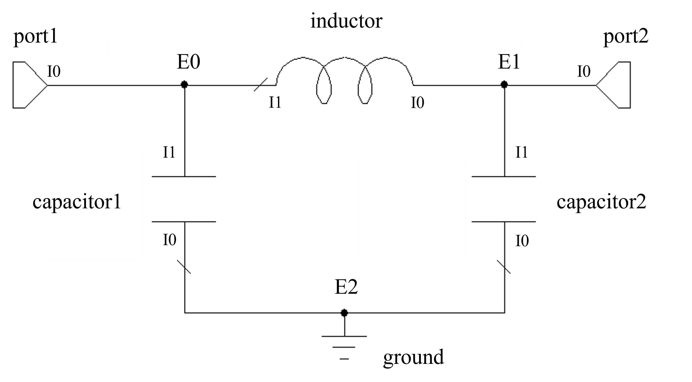

Introduction
=====================

**Parax** provides a declarative modelling interface that compiles RF models, such as circuit models, using *JAX*. This page provides in introduction into how such models are created, and an overview of the fitting and sampling procedures.

Core Concepts
~~~~~~~~~~~~~~~~~~~~

The library revolves around a few key building blocks:

* :class:`pmrf.Model`: The base class for any RF model. When inherited from, methods such as *s*, *a*, *z* and *y* can be overriden to define model S-parameters, ABCD-parameters etc. These methods all accept frequency as input. On the other hand, *__call__* can be overridden to return a model instance itself, for more complex compositional model building.
* :class:`pmrf.core.parameter`: A parameter in a model, storing its value and metadata. This allows for parameter bounds and scaling, marking parameters as *fixed*, and associating a *distribution* with the parameter for Bayesian fitting.
* :class:`from pmrf.core.frequency`: A wrapper around a JAX array that defines the frequency axis over which models are evaluated.

Model Composition
~~~~~~~~~~~~~~~~~~~~
**Parax** provides a component library with commonly-used models such as lumped and distributed elements. Models can be built directly using these in a compositional approach.

Cascaded Models
^^^^^^^^^^^^^^^^^^^
For simple circuit element chains, the ** operator can be used to cascade several models together.

The example below creates an RLC filter and terminates it in an open circuit. The resultant ``rlc`` is a first-class :class:`pmrf.Model` of type :class:`pmrf.models.composite.interconnected.Cascade`, consisting of parameters representing the respective *R*, *L* and *C* parameters. The S11 is then plotted using matplotlib.

.. code-block:: python

    import pmrf as prf
    from pmrf.core import Resistor, Inductor, ShuntCapacitor, OPEN
    from pmrf.parameters import Fixed

    # Instantiate the lumped element models
    resistor = Resistor(R=100.0)
    inductor = Inductor(L=prf.Parameter(2.0, scale=1e-9)) # we can optionally provide a parameter scale
    capacitor = ShuntCapacitor(C=1.0e-12, name="cap") # naming makes parameter manipulation later easy

    # Cascade the models, storing the result.
    # We also create a terminated version with a new, fixed C
    rlc = resistor ** inductor ** capacitor
    terminated_rlc = rlc.terminated(OPEN).with_params(cap_C=Fixed(0.5e-12))

    # Plot the S11 of the terminated model at a specified frequency range
    freq = prf.Frequency(1, 1000, 1000, 'MHz')
    terminated_rlc.plot_s_db(freq, m=0, n=0)

Circuit Models
^^^^^^^^^^^^^^^^^^^
For complex circuits, Parax offers the ability to combine models in any desired configuration using the :class:`pmrf.models.composite.interconnected.Circuit` class. This class accepts a list of "connections". Each entry in this list is a node in the circuit. Each node is another list, with each element being a tuple for each connected circuit element or sub-model. Each tuple then contains the model object, as well as the index of the port for that model that is connected in that node.

The following example uses this method to define a two-port PI-CLC network. "External" nodes (each entry in the outer list) are numbered as E0, E1 etc. whereas "internal" port indices (ports for each model in the circuit) are numbered per element as I0, I1 etc. The model is then converted to a scikit-rf network and plotted.

.. code-block:: python

    import pmrf as prf
    from pmrf.core import Capacitor, Inductor, Circuit, Port, Ground

    # Instantiate the elements, ports and grounds
    capacitor1, capacitor2 = Capacitor(C=2e-12), Capacitor(C=1.5e-12)
    inductor = Inductor(L=3e-9)
    port1, port2 = Port(), Port()
    ground = Ground()

    # Create the connections list
    connections = [
        [(port1, 0), (capacitor1, 1), (inductor, 1)], # E0
        [(port2, 0), (capacitor2, 1), (inductor, 0)], # E1
        [(ground, 0), (capacitor1, 0), (capacitor2, 0)], # E2
    ]

    # Create the model and plot it's S21 parameter
    pi_clc = Circuit(connections)
    freq = prf.Frequency(1, 1000, 1001, 'MHz')
    pi_clc.plot_s_db(freq, m=1, n=0)

    # Note that Parax already provides a built in, more efficient PiCLC model
    from pmrf.core import PiCLC
    PiCLC(2e-12, 3e-9, 1.5e-12).plot_s_db(freq, m=1, n=0)

Model Inheritance
~~~~~~~~~~~~~~~~~~~~
For more complex models (such as equation-based ones), users can inherit directly from the :class:`pmrf.Model` class and override one of the network properties (such as ``s``, ``a``, or ``y``) or the ``__call__`` method.

Any attributes of a model are classified as either *static* or *dynamic*. By default, fields of built-in types such as ``str``, ``int``, ``list`` etc. are seen as static in the model hierarchy, whereas those annotated as a :class:`pmrf.core.parameter` or :class:`pmrf.Model` are dynamic and can be adjusted (for example, by fitting routines).

Note that parameter initialization is flexible: parameters may be populated with a simple float value; using factory methods such as :class:`pmrf.parameters.Uniform`, :class:`pmrf.parameters.Normal` or :class:`pmrf.parameters.Fixed`; or directly using the :class:`pmrf.core.parameter` class constructor.

Equation-based Models
^^^^^^^^^^^^^^^^^^^^^
The following example demonstrates custom model definition by defining a capacitor from first principles. This could be used, for example, to implement more complex analytic or surrogate models. Here, one of the typical network properties, such as :meth:`pmrf.Model.s`, :meth:`pmrf.Model.a`, :meth:`pmrf.Model.y`, or :meth:`pmrf.Model.z`, must be overriden, returning the resultant matrix directly.

.. code-block:: python

    import jax.numpy as jnp
    import pmrf as prf

    # Define a model class. Behaviour is defined by implementing 
    # a primary matrix function such as "s" in this case.
    class Capacitor(prf.Model):
        C: prf.Parameter = 1.0e-12

        def s(self, freq: prf.Frequency) -> jnp.ndarray:
            w = freq.w
            C = self.C

            z0_0 = z0_1 = self.z0
            denom = 1.0 + 1j * w * C * (z0_0 + z0_1)
            s11 = (1.0 - 1j * w * C * (jnp.conj(z0_0) - z0_1) ) / denom
            s22 = (1.0 - 1j * w * C * (jnp.conj(z0_1) - z0_0) ) / denom
            s12 = s21 = (2j * w * C * (z0_0.real * z0_1.real)**0.5) / denom

            return jnp.array([
                [s11, s12],
                [s21, s22]
            ]).transpose(2, 0, 1)

Circuit Models
^^^^^^^^^^^^^^^^^^^
Sometimes it is still convenient to inherit from :class:`pmrf.Model` while still building the model using cascading or :class:`pmrf.models.composite.interconnected.Circuit`. In this case, the model can be built from sub-models fields/attributes, and returned by overriding the :meth:`pmrf.Model.__call__` method.

The following example creates a PI-CLC model once again, but using the above method. Note how certain parameters can be given initial parameters, bounds or fixed to a constant (useful for fitting).

.. code-block:: python

    import pmrf as prf
    from pmrf.core import Capacitor, Inductor, Circuit, Port, Ground
    from pmrf.parameters import Uniform, Fixed

    class PiCLC(prf.Model):
        capacitor1: Capacitor =     Capacitor(C=Fixed(1.0e-12))
        capacitor2: Capacitor =     Capacitor(C=Uniform(0.0, 10.0, value=2.0, scale=1e-12))
        inductor: Inductor =        Inductor(L=Uniform(0.0, 10.0, value=2.0, scale=1e-12))

        def __call__(self) -> prf.Model:
            # Instantiate the ports and grounds
            port1, port2, ground = Port(), Port(), Ground()

            # Create the connections list. This time, capacitor1, capacitor2 and inductor are members.
            connections = [
                [(port1, 0), (self.capacitor1, 1), (self.inductor, 1)], # E0
                [(port2, 0), (self.capacitor2, 1), (self.inductor, 0)], # E1
                [(ground, 0), (self.capacitor1, 0), (self.capacitor2, 0)], # E2
            ]

            # Return the model
            return Circuit(connections)

Model Manipulation
~~~~~~~~~~~~~~~~~~
Parax excels at manipulating models through deep hierarchies.

The following examples creates a circuit model consisting of several nested sub-circuits. Parameters can then be easily manipulated using the `with_xxx` routines.

Fitting
~~~~~~~~~~~~~~~~~~~~

Parax provides the ability to easily fit models and their parameters to measured data. The :mod:`pmrf.fitting` module provides a unified interface to do this using either traditional *frequentist* optimization (e.g. the usual "least squares" approach), or using more state-of-the-art *Bayesian* inference techniques.

The general workflow consists of defining a model, loading data via *scikit-rf*, initializing the fitter with the model and the mathematics/goals of the problem, and running the fitter with the specified settings.

Main Fitters
^^^^^^^^^^^^^^^^^^^^

* :class:`pmrf.fitting.SciPyMinimizeFitter`: Provides access to gradient-based and gradient-free optimization algorithms from ``scipy.optimize``. This includes algorithms such as *SLSQP*, *Nelder-Mead* and *L-BFGS*.
* :class:`pmrf.fitting.PolyChordFitter`: Enables Bayesian inference through nested sampling from ``pypolychord``. This approach provides maximum likelihood parameter values, as well as full posterior probability distributions and Bayesian evidence useful for model comparison and uncertainty quantification.

Example
^^^^^^^^^^^^^^^^^^^^

The following provides a complete example of fitting the built in :mod:`pmrf.models.components.line.CoaxialLine` model to the measurement of 10m coaxial cable (provided as an example in the `GitHub <https://github.com/parax/parax/tree/main/examples>`_). Data is loaded using scikit-rf; the model is instantiated with appropriate initial parameters; the fitter is configured with a custom cost function and subsequently run; and results are plotted.

.. literalinclude:: ../../../examples/2_fit_cable_scipy.py
   :language: python

Sampling
~~~~~~~~~~~~~~~~~~~~

Parax also provides the ability to randomly or adaptively sample models. The :mod:`pmrf.sampling` module provides an interface for this, with simple one-shot sampling algorithms such as *uniform* or *Latin Hypercube*, as well as more advanced adaptive sampling algorithms (such as *uncertainty* sampling) for expensive EM simulations.

Main Samplers
^^^^^^^^^^^^^^^^^^^^

* :class:`pmrf.sampling.UniformSampler`: Uniform sampling.
* :class:`pmrf.sampling.LatinHypercubeSampler`: Latin hypercube sampling.
* :class:`pmrf.sampling.EqxLearnUncertaintySampler`: Enables surrogate model uncertainty sampling from ``eqx-learn``. This provides the ability to uncertainty sample using classical machine learning surrogate models, such as Gaussian Processes.

Example
^^^^^^^^^^^^^^^^^^^^

The below example demonstrates the sampling of 10 different resistor networks with uniform resistance between 9 and 11 ohms.

.. literalinclude:: ../../../examples/3_simulate_resistor.py
   :language: python